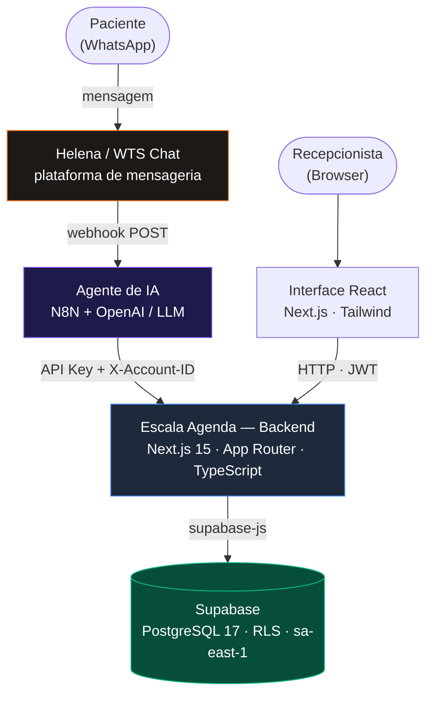
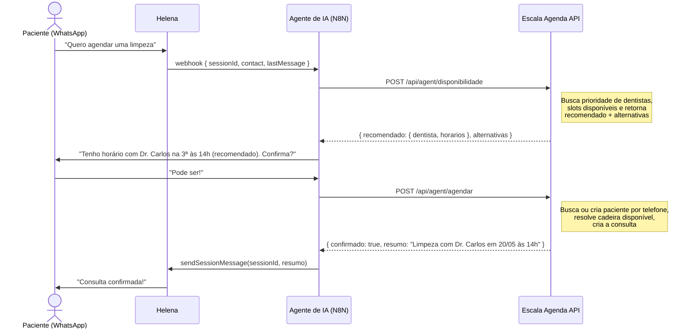
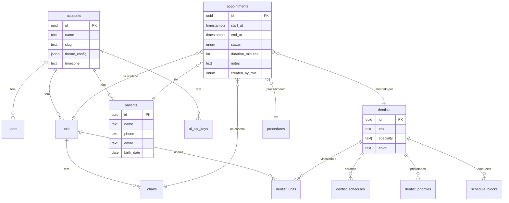
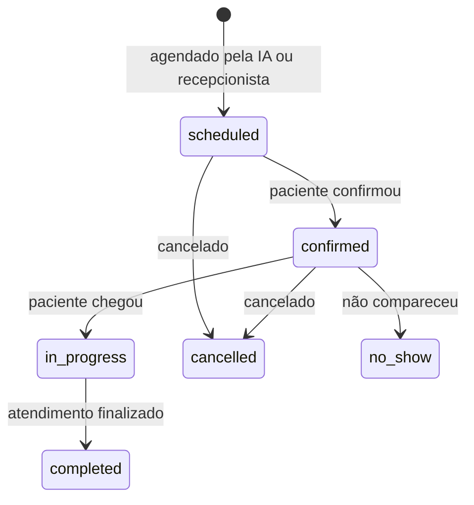
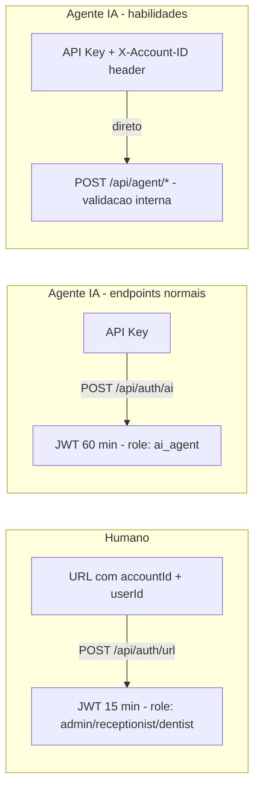
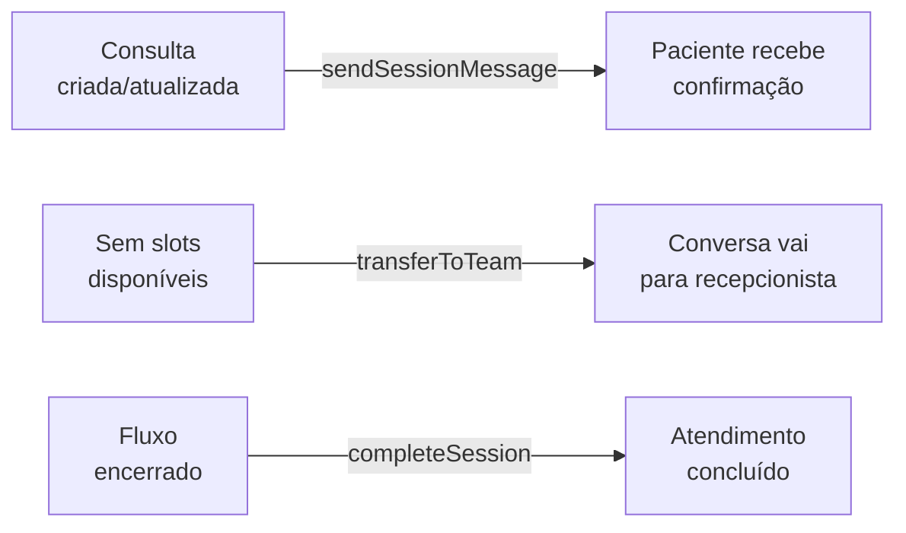
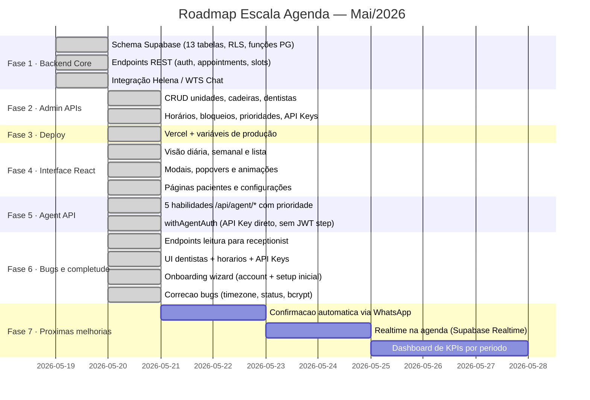

<div align="center">

# Escala Agenda

### Agenda Odontológica White Label com IA Nativa

<br/>

[](https://nextjs.org)
[](https://typescriptlang.org)
[](https://supabase.com)
[](https://postgresql.org)
[](https://tailwindcss.com)

<br/>

> Plataforma de agendamento clínico **multi-tenant** para clínicas odontológicas.  
> Serve humanos via interface React e **agentes de IA via REST API** — com as mesmas regras de negócio, os mesmos dados e os mesmos slots disponíveis.

<br/>

</div>

---

## O que este produto resolve

<table>
<tr>
<td width="50%">

**Para humanos**

Recepcionistas, dentistas e gestores acessam via **interface React** com URL parametrizada. Cada papel enxerga exatamente o que precisa — sem configuração de login adicional.

</td>
<td width="50%">

**Para agentes de IA**

O agente de WhatsApp usa **5 endpoints dedicados** (`/api/agent/*`) que encapsulam toda a lógica de negócio em uma chamada só. Lookup de paciente por telefone, prioridade de dentistas e resolução de cadeira acontecem internamente.

</td>
</tr>
</table>

---

## Arquitetura do Sistema



---

## Fluxo do Agente de IA (habilidades)

O agente possui **5 habilidades** — cada uma é uma única chamada HTTP com JSON + headers. Toda a lógica interna (lookup de paciente, prioridade, slots, cadeiras) é resolvida pelo backend.



---

## Habilidades do Agente (`/api/agent/*`)

Autenticação: `Authorization: Bearer <api_key>` + `X-Account-ID: <account_id>` em todos os endpoints.

### POST `/api/agent/disponibilidade`

Retorna slots disponíveis com dentista recomendado ordenado por prioridade (histórico do paciente → menor ocupação → score configurável).

```json
// Request
{
  "data": "2026-05-20",
  "unit_id": "uuid",
  "procedure_id": "uuid",
  "telefone": "5511999887766",
  "quantidade_dentistas": 2
}

// Response
{
  "data": "2026-05-20",
  "paciente_id": "uuid-ou-null",
  "recomendado": {
    "dentista_id": "uuid",
    "dentista": "Dr. Carlos",
    "horarios": ["09:00", "10:00", "14:00"],
    "motivo": "Histórico com o paciente"
  },
  "alternativas": [
    { "dentista_id": "uuid", "dentista": "Dra. Ana", "horarios": ["11:00", "15:00"] }
  ]
}
```

### POST `/api/agent/agendar`

Busca ou cria o paciente pelo telefone. Se `chair_id` não informado, encontra automaticamente a primeira cadeira disponível.

```json
// Request
{
  "telefone": "5511999887766",
  "nome_paciente": "João Silva",
  "dentista_id": "uuid",
  "horario": "2026-05-20T14:00:00Z",
  "procedure_id": "uuid",
  "unit_id": "uuid"
}

// Response
{
  "confirmado": true,
  "agendamento_id": "uuid",
  "resumo": "Limpeza com Dr. Carlos em 20/05 às 14h"
}
```

### POST `/api/agent/cancelar`

Se `agendamento_id` omitido, cancela a próxima consulta futura do paciente.

```json
// Request
{ "telefone": "5511999887766", "agendamento_id": "uuid" }

// Response
{ "cancelado": true, "resumo": "Limpeza com Dr. Carlos em 20/05 às 14h foi cancelada" }
```

### POST `/api/agent/remarcar`

Reagenda para novo horário. Se mudar de dentista e a cadeira original conflitar, resolve automaticamente outra cadeira disponível.

```json
// Request
{
  "telefone": "5511999887766",
  "agendamento_id": "uuid",
  "novo_horario": "2026-05-21T10:00:00Z",
  "novo_dentista_id": "uuid"
}

// Response
{ "reagendado": true, "agendamento_id": "uuid", "resumo": "Limpeza com Dr. Carlos remarcada para 21/05 às 10h" }
```

### POST `/api/agent/consultar`

Retorna a próxima consulta agendada do paciente.

```json
// Request
{ "telefone": "5511999887766" }

// Response
{
  "tem_agendamento": true,
  "proxima_consulta": {
    "id": "uuid",
    "data": "2026-05-20",
    "horario": "14:00",
    "dentista": "Dr. Carlos",
    "procedimento": "Limpeza",
    "unidade": "Unidade Centro",
    "status": "scheduled",
    "resumo": "Limpeza com Dr. Carlos em quarta-feira, 20/05/2026 às 14h na Unidade Centro"
  }
}
```

---

## Modelo de Dados



### Ciclo de status de uma consulta



---

## Autenticação

Dois modelos distintos de autenticação:



| Tipo | Como autentica | Expiração |
|------|---------------|-----------|
| Humano | `POST /api/auth/url` → JWT no header | 15 min |
| Agente (API geral) | `POST /api/auth/ai` → JWT no header | 60 min |
| Agente (habilidades) | `Authorization: Bearer <api_key>` + `X-Account-ID` | Sem JWT — valida a key diretamente |

> API Keys são armazenadas com hash bcrypt — texto plano nunca persiste no banco.

---

## Endpoints da API

### Autenticação
| Método | Endpoint | Acesso | Descrição |
|--------|----------|:------:|-----------|
| `POST` | `/api/auth/url` | Público | Auth humano via URL → JWT 15min |
| `POST` | `/api/auth/ai` | Público | Auth agente via API Key → JWT 60min |

### Habilidades do Agente (API Key direto)
| Método | Endpoint | Descrição |
|--------|----------|-----------|
| `POST` | `/api/agent/disponibilidade` | Slots disponíveis + dentista recomendado por prioridade |
| `POST` | `/api/agent/agendar` | Cria consulta (lookup/criação de paciente por telefone) |
| `POST` | `/api/agent/cancelar` | Cancela próxima ou consulta específica |
| `POST` | `/api/agent/remarcar` | Reagenda com resolução automática de cadeira |
| `POST` | `/api/agent/consultar` | Próxima consulta agendada do paciente |

### Agendamento
| Método | Endpoint | Acesso | Descrição |
|--------|----------|:------:|-----------|
| `GET` | `/api/dentists/priority` | Autenticado | Dentistas priorizados por contexto |
| `GET` | `/api/slots/available` | Autenticado | Slots livres por dentista/data |
| `GET` | `/api/appointments` | Autenticado | Listar consultas (filtros + paginação) |
| `POST` | `/api/appointments` | Admin · Recep · IA | Criar consulta |
| `PATCH` | `/api/appointments/:id` | Admin · Recep · IA | Reagendar (novo horário/dentista) |
| `PATCH` | `/api/appointments/:id/status` | Autenticado¹ | Atualizar status |

### Pacientes
| Método | Endpoint | Acesso | Descrição |
|--------|----------|:------:|-----------|
| `GET` | `/api/patients` | Autenticado | Buscar por nome ou telefone |
| `POST` | `/api/patients` | Admin · Recep · IA | Criar paciente |
| `PATCH` | `/api/patients/:id` | Admin · Recep · IA | Atualizar dados |
| `DELETE` | `/api/patients/:id` | Admin | Remover paciente |

### Leitura pública (todos os roles autenticados)
| Método | Endpoint | Descrição |
|--------|----------|-----------|
| `GET` | `/api/dentists` | Lista dentistas da conta |
| `GET` | `/api/units` | Lista unidades ativas |
| `GET` | `/api/procedures` | Lista procedimentos ativos |

### Onboarding
| Método | Endpoint | Acesso | Descrição |
|--------|----------|:------:|-----------|
| `POST` | `/api/onboarding/account` | Público | Cria account + admin user, retorna JWT |

### Administração
| Método | Endpoint | Acesso | Descrição |
|--------|----------|:------:|-----------|
| `GET/PATCH` | `/api/admin/account` | Admin | Configurações gerais (cadência da grade, timezone) |
| `GET/POST` | `/api/admin/units` | Admin | CRUD unidades |
| `GET/POST` | `/api/admin/dentists` | Admin | CRUD dentistas |
| `GET/POST` | `/api/admin/chairs` | Admin | CRUD cadeiras |
| `GET/POST` | `/api/admin/procedures` | Admin | CRUD procedimentos |
| `GET/POST` | `/api/admin/api-keys` | Admin | Gerenciar API Keys |
| `GET/POST` | `/api/admin/dentists/:id/schedules` | Admin | Horários de trabalho |
| `GET/POST` | `/api/admin/dentists/:id/blocks` | Admin | Bloqueios de agenda |
| `GET/POST` | `/api/admin/dentists/:id/priorities` | Admin | Prioridades por unidade |

### Helena
| Método | Endpoint | Acesso | Descrição |
|--------|----------|:------:|-----------|
| `POST` | `/api/helena/transfer` | Autenticado | Transferir conversa para equipe humana |

> ¹ IA só pode setar `cancelled`. Dentista não pode `cancelled` nem `no_show`.

---

## Prioridade de Dentistas

O sistema de prioridade é uma **recomendação**, não uma atribuição forçada. O agente apresenta o dentista recomendado ao paciente, que pode escolher outro.

A ordenação considera três critérios em cascata:

| Critério | Peso | Lógica |
|----------|------|--------|
| Histórico com o paciente | Alto | Dentista que já atendeu este paciente vai para o topo |
| Ocupação do dia | Médio | Dentista com menos consultas no dia é preferido |
| Score de prioridade | Base | Configurado manualmente pelo admin por unidade (`dentist_units.priority`) |

A especialidade do procedimento é usada como filtro hard — dentistas sem a especialidade requerida são excluídos antes da ordenação.

---

## Slots: duração real do procedimento e cadência da grade

A grade de horários **respeita a duração real de cada procedimento** — não existe "30 min fixo".
A RPC `get_available_slots` resolve a duração a partir de `procedures.duration_minutes`
(ou de um override explícito) e **reserva o intervalo inteiro** `[início, início + duração)`.
Um procedimento de 90 min ocupa de fato 90 min seguidos: nenhuma outra consulta encaixa no meio.

A **cadência** (de quanto em quanto tempo um horário de início é oferecido) é um conceito
separado da duração e é **configurável** — em vez de um `30` fixo no código:

| Origem (precedência) | Onde | Padrão |
|----------------------|------|--------|
| Override por chamada | parâmetro `p_slot_interval` da RPC | — |
| Configuração da conta | coluna `accounts.slot_interval_minutes` | `30` |
| Fallback de segurança | dentro da função | `30` |

Resolução: `COALESCE(p_slot_interval, accounts.slot_interval_minutes, 30)`.

> **Por que assim, e não como a tarefa original sugeria:** a versão herdada da RPC já
> respeitava a duração real (o slot terminava em `início + duração` e a checagem de conflito
> cobria o intervalo inteiro). O único valor fixo remanescente era a *cadência*. Em vez de
> apenas removê-la, transformamos o `30` num default de coluna configurável por clínica +
> override por chamada — eliminando o hardcode sem reduzir as opções de horário.

Assinatura atual:

```sql
get_available_slots(
  p_dentist_id        uuid,
  p_unit_id           uuid,
  p_procedure_id      uuid,
  p_date              date,
  p_duration_override integer DEFAULT NULL,  -- sobrepõe a duração do procedimento
  p_slot_interval     integer DEFAULT NULL   -- sobrepõe a cadência da conta
)
```

Validado com teste funcional (procedimento de 90 min, expediente 09:00–12:00):

| Cenário | Resultado |
|---------|-----------|
| 90 min, cadência 30, agenda livre | `09:00-10:30, 09:30-11:00, 10:00-11:30, 10:30-12:00` |
| 90 min, cadência 60 (override) | `09:00-10:30, 10:00-11:30` |
| 90 min, com consulta ocupando 10:00–11:00 | nenhum slot livre (o intervalo inteiro é respeitado) |

---

## Interface React

Acesso via URL parametrizada: `/{accountId}?userId={externalId}`

| Página | Rota | Quem acessa |
|--------|------|-------------|
| Onboarding | `/onboarding` | Público — setup inicial de nova conta |
| Agenda | `/{accountId}` | Todos |
| Pacientes | `/{accountId}/pacientes` | Admin · Recepcionista |
| Configurações | `/{accountId}/configuracoes` | Admin |

### Visualizações da agenda

- **Diária** — colunas por dentista, blocos de consulta clicáveis com popover de detalhes
- **Semanal** — grid 7 dias com filtro por dentista, dados via API com range de datas
- **Lista** — tabela cronológica com status colorido

### Modais e interações

- `NewAppointmentModal` — criar nova consulta com seleção de dentista, data, hora e procedimento
- `RescheduleModal` — reagendar consulta existente via `PATCH /api/appointments/:id`
- `DayReportModal` — relatório do dia com KPIs (total, confirmadas, canceladas, taxa)
- `AppointmentPopover` — detalhes rápidos ao clicar em um bloco (ações: confirmar, reagendar, cancelar)

### Configurações (abas)

| Aba | Funcionalidades |
|-----|----------------|
| Geral | Cadência da grade de horários (`accounts.slot_interval_minutes`) |
| Unidades | CRUD completo de unidades físicas |
| Cadeiras | CRUD de consultórios por unidade |
| Procedimentos | CRUD com cor, duração e especialidade requerida |
| Profissionais | CRUD de dentistas + modal de horários de trabalho por unidade/dia |
| API Keys | Criar, ativar/desativar e revogar chaves para o agente de IA |

---

## Integração Helena (WTS Chat)



```typescript
// src/lib/helena.ts
sendText(to, from, text)              // mensagem avulsa para contato
sendSessionMessage(sessionId, text)   // dentro de conversa ativa
transferToTeam(sessionId, deptId)     // encaminhar para equipe humana
completeSession(sessionId)            // encerrar atendimento
```

---

## Configuração

### Variáveis de ambiente

```bash
# Supabase — projeto: Contact-Calendar | ref: xcyltcfxrguvjlaqnqfd | região: sa-east-1 (São Paulo)
NEXT_PUBLIC_SUPABASE_URL=https://<ref>.supabase.co
NEXT_PUBLIC_SUPABASE_ANON_KEY=<anon-key>
SUPABASE_SERVICE_ROLE_KEY=<service-role-key>      # nunca no frontend

# JWT — gere com: openssl rand -base64 32
JWT_SECRET=<random-base64-32>

# Helena / WTS Chat
HELENA_API_TOKEN=<bearer-token-da-plataforma>
HELENA_BASE_URL=https://api.wts.chat
```

### Instalação

```bash
git clone https://github.com/contactIA/Contact-Calendar.git
cd escala-agenda
npm install
cp .env.example .env.local    # preencha as variáveis acima
npm run dev                   # → http://localhost:3000
```

### Banco de dados (migrations)

O schema versionado vive em `supabase/migrations/`. Para recriar o banco do zero
(ex.: novo projeto Supabase), aplique as migrations em ordem:

```
0001_init_schema.sql                # 13 tabelas, 4 enums, índices, funções e RLS
0002_configurable_slot_cadence.sql  # cadência da grade configurável (ver abaixo)
0003_appointment_overlap_guard.sql  # trava anti-corrida + match de telefone (ver "Correções")
```

> **Atenção à 0003:** ela cria constraints `EXCLUDE` em `appointments`. Como
> `EXCLUDE` não aceita `NOT VALID`, a migration falha se já houver agendamentos
> ativos sobrepostos no banco. Em base limpa não há impacto; havendo dados
> legados, resolva as sobreposições antes de aplicar.

Após qualquer migration, regenere os tipos: `src/types/database.ts`.

---

## Segurança

| Risco | Mitigação |
|-------|-----------|
| Double booking concorrente | Constraints `EXCLUDE` (btree_gist) em `appointments` garantem no banco que dois agendamentos ativos não se sobreponham por dentista ou cadeira; a checagem com `check_appointment_conflict` continua como fast-path amigável (migration 0003) |
| Cross-tenant data leak | `account_id` em todas as queries + RLS no Supabase como 2ª linha |
| API Key vazada | Armazenada com bcrypt hash — texto plano nunca persiste no banco |
| JWT adulterado | HS256 com `JWT_SECRET`, verificado em cada request via `withAuth` |
| `service_role` exposto | Só existe em API Routes server-side, nunca em variável `NEXT_PUBLIC_` |
| Dados de pacientes em logs | Nenhum campo sensível (`phone`, `email`, `name`) é logado |

---

## Correções (API do agente `/api/agent/*`)

Revisão da API do agente de IA e respectivas correções. Cada item abaixo foi
verificado contra o código e o schema antes de ser tratado.

| # | Severidade | Problema | Correção |
|---|------------|----------|----------|
| 1 | Alta | **Race condition (TOCTOU) no agendamento.** `check_appointment_conflict` e o `INSERT`/`UPDATE` eram operações separadas; dois pedidos simultâneos no mesmo slot passavam os dois. | Constraints `EXCLUDE` (btree_gist) em `appointments` (migration 0003) tornam a sobreposição impossível no banco. `agendar`/`remarcar` convertem o `exclusion_violation` (código `23P01`) em **HTTP 409**. |
| 2 | Média | **Match de paciente por telefone frágil.** Era `ILIKE '%últimos 10 dígitos%'` — match por substring que colide entre pacientes e escolhia um às cegas com `.limit(1)`. | RPC `find_patients_by_phone` compara somente dígitos (ignora DDI/DDD/máscara) e o helper `findPatientByPhone` retorna `none`/`one`/`many`. Telefone ambíguo agora devolve **409** (em `disponibilidade`, apenas ignora o histórico, sem bloquear). |
| 3 | Média | **`remarcar` não buscava cadeira alternativa** quando só o horário mudava: se a cadeira original estivesse ocupada no novo horário, retornava 409 direto. | Passa a procurar qualquer cadeira ativa livre na unidade sempre que a cadeira preferida conflita — só retorna 409 quando o conflito é do **dentista**/bloqueio ou não há cadeira livre. |
| 4 | Baixa | **Erros do Supabase engolidos.** Várias leituras faziam `const { data } = ...` sem checar `error`, mascarando falha de banco como "não encontrado". | Leituras passam a checar `error` e retornam **500** real. |
| 5 | Baixa | **`procedure_id` opcional em `disponibilidade`**, mas a RPC `get_available_slots` o exige (sem default) e o SQL precisa dele para a duração do slot. | `procedure_id` passou a ser **obrigatório** no schema do endpoint. |
| 6 | Baixa | **Limpezas.** Imports `NextRequest` não usados; `let` desnecessário; o middleware do agente assinava um JWT e o reverificava no mesmo request. | Imports/variáveis removidos; `authenticateAiAgent` devolve o payload e `withAgentAuth` usa o contexto direto. |

> **Não era bug:** a chamada de `get_available_slots` com 4 argumentos nomeados
> funciona — os 2 parâmetros extras da RPC (6 args no total) têm `DEFAULT NULL`,
> então o PostgREST resolve a sobrecarga única sem ambiguidade.

**Pendência operacional:** a migration `0003` precisa ser aplicada ao Supabase
`Contact-Calendar` (`supabase db push` ou MCP `apply_migration`) para as travas
entrarem em vigor. Até lá, a proteção contra corrida segue valendo só pelo
fast-path (não atômico).

---

## Estrutura do Projeto

```
escala-agenda/
└── src/
    ├── app/
    │   ├── [accountId]/
    │   │   ├── page.tsx                          ← Agenda principal
    │   │   ├── pacientes/page.tsx                ← Gestão de pacientes
    │   │   └── configuracoes/page.tsx            ← Configurações da clínica
    │   └── api/
    │       ├── auth/
    │       │   ├── url/route.ts                  ← Auth humano → JWT 15min
    │       │   └── ai/route.ts                   ← Auth agente → JWT 60min
    │       ├── agent/
    │       │   ├── disponibilidade/route.ts      ← Habilidade: slots + prioridade
    │       │   ├── agendar/route.ts              ← Habilidade: criar consulta
    │       │   ├── cancelar/route.ts             ← Habilidade: cancelar
    │       │   ├── remarcar/route.ts             ← Habilidade: reagendar
    │       │   └── consultar/route.ts            ← Habilidade: verificar agendamento
    │       ├── appointments/
    │       │   ├── route.ts                      ← GET lista + POST criar
    │       │   ├── [id]/route.ts                 ← PATCH reagendar
    │       │   ├── [id]/status/route.ts          ← PATCH status
    │       │   └── check-conflicts/route.ts      ← Verificação pré-agendamento
    │       ├── slots/
    │       │   └── available/route.ts            ← Slots disponíveis (RPC)
    │       ├── patients/
    │       │   ├── route.ts                      ← GET busca + POST criar
    │       │   └── [id]/route.ts                 ← PATCH + DELETE
    │       ├── dentists/
    │       │   └── priority/route.ts             ← Lista priorizada
    │       ├── admin/
    │       │   ├── units/                        ← CRUD unidades
    │       │   ├── dentists/                     ← CRUD dentistas + horários + bloqueios
    │       │   ├── chairs/                       ← CRUD cadeiras
    │       │   ├── procedures/                   ← CRUD procedimentos
    │       │   └── api-keys/                     ← Gerenciar API Keys
    │       └── helena/
    │           └── transfer/route.ts             ← Transferir conversa
    ├── components/
    │   └── agenda/
    │       ├── AgendaShell.tsx                   ← Orquestrador principal da agenda
    │       ├── AgendaHeader.tsx                  ← Barra superior (filtros, data, visualização)
    │       ├── AgendaSidebar.tsx                 ← Menu lateral com navegação
    │       ├── AppointmentBlock.tsx              ← Bloco de consulta nos views
    │       ├── AppointmentPopover.tsx            ← Popover de detalhes ao clicar
    │       ├── DayReportModal.tsx                ← Relatório do dia com KPIs
    │       ├── KPIStrip.tsx                      ← Faixa de métricas rápidas
    │       ├── modals/
    │       │   ├── NewAppointmentModal.tsx       ← Criar nova consulta
    │       │   └── RescheduleModal.tsx           ← Reagendar consulta existente
    │       └── views/
    │           ├── DailyView.tsx                 ← Visão diária por colunas
    │           ├── WeeklyView.tsx                ← Visão semanal (7 dias)
    │           └── ListView.tsx                  ← Visão em lista cronológica
    ├── hooks/
    │   ├── useAuth.ts                            ← Autenticação e JWT
    │   ├── useAppointments.ts                    ← Fetch de consultas
    │   └── useAnimatedMount.ts                   ← Animações de entrada/saída
    └── lib/
        ├── supabase.ts                           ← Clients anon + service role (lazy)
        ├── auth.ts                               ← JWT sign/verify + autenticadores
        ├── api.ts                                ← withAuth wrapper + helpers ok/err
        ├── agentAuth.ts                          ← withAgentAuth (API Key direto) + normalizePhone
        └── helena.ts                             ← Client da API Helena / WTS Chat
```

---

## Roadmap



---

## Desenvolvimento local

```bash
npm run dev      # servidor em http://localhost:3000
npm run build    # build de produção
npx tsc --noEmit # type check
```
