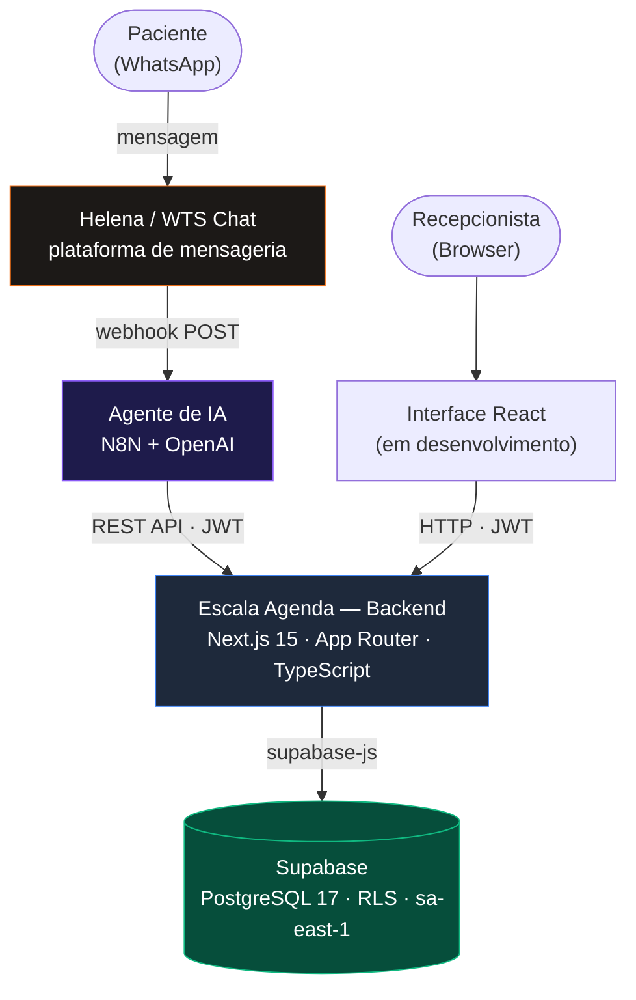
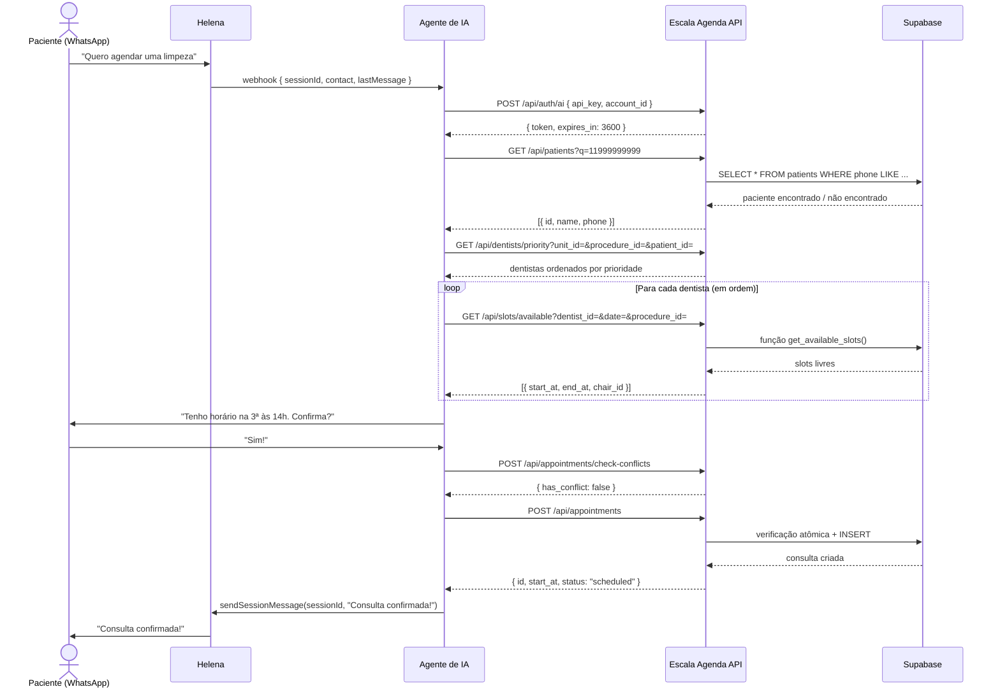
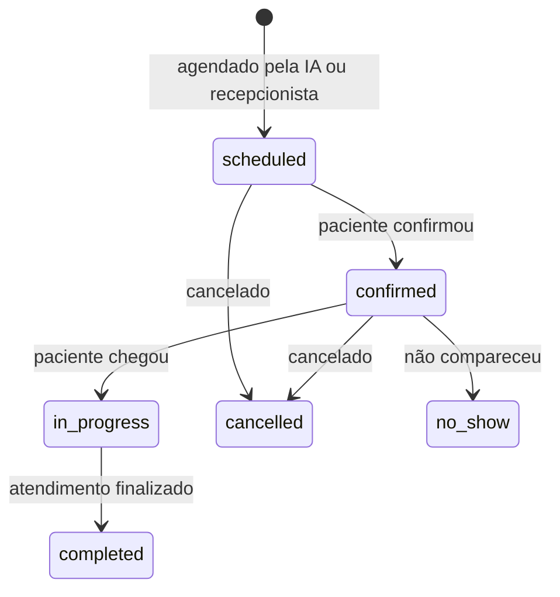
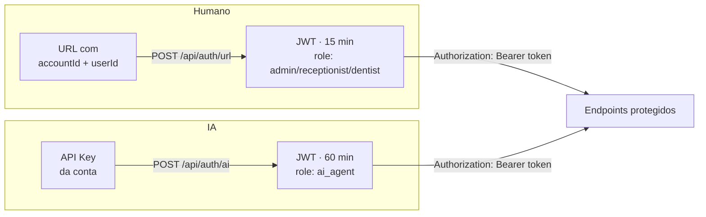
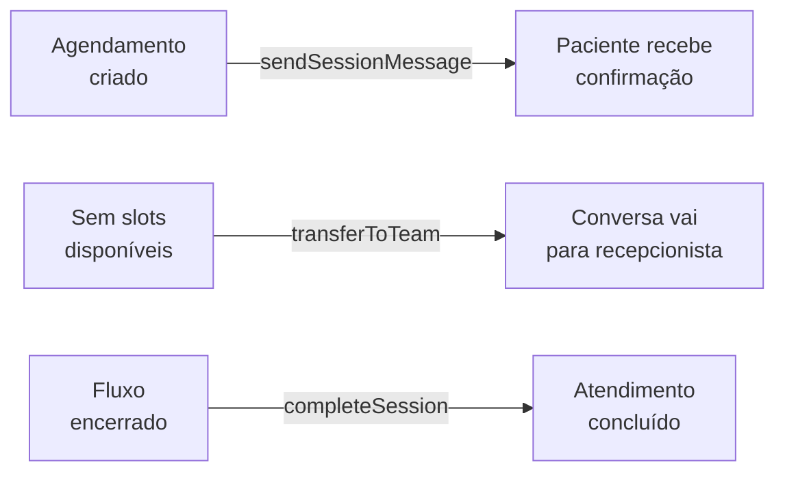
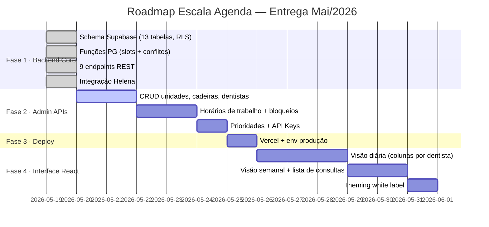

<div align="center">

# Escala Agenda

### Agenda Odontológica White Label com IA Nativa

<br/>

[](https://nextjs.org)
[](https://typescriptlang.org)
[](https://supabase.com)
[](https://postgresql.org)
[](https://tailwindcss.com)

<br/>

> Plataforma de agendamento clínico **multi-tenant** para clínicas odontológicas.  
> Serve humanos via interface React e **agentes de IA via REST API** — com as mesmas regras de negócio, os mesmos dados e os mesmos slots disponíveis.

<br/>

</div>

---

## O que este produto resolve

<table>
<tr>
<td width="50%">

**Para humanos**

Recepcionistas, dentistas e gestores acessam via **interface React** com URL parametrizada. Cada papel enxerga exatamente o que precisa — sem configuração de login adicional.

</td>
<td width="50%">

**Para agentes de IA**

O agente de WhatsApp consome a mesma **REST API** que a recepcionista usa. Mesmas regras, mesmos dados, mesma proteção contra conflitos — canal diferente.

</td>
</tr>
</table>

---

## Arquitetura do Sistema



---

## Fluxo Completo do Agente de IA



---

## Modelo de Dados


### Ciclo de status de uma consulta



---

## Autenticação



| Tipo | Endpoint | Expiração | Renovação |
|------|----------|-----------|-----------|
| Humano | `POST /api/auth/url` | 15 min | Automática via refresh |
| Agente IA | `POST /api/auth/ai` | 60 min | Agente re-autentica |

> API Keys são armazenadas com hash bcrypt — texto plano nunca persiste no banco.

---

## Endpoints da API

### Autenticação
| Método | Endpoint | Acesso | Descrição |
|--------|----------|:------:|-----------|
| `POST` | `/api/auth/url` | Público | Auth humano via URL → JWT 15min |
| `POST` | `/api/auth/ai` | Público | Auth agente via API Key → JWT 60min |

### Agendamento
| Método | Endpoint | Acesso | Descrição |
|--------|----------|:------:|-----------|
| `GET` | `/api/dentists/priority` | Autenticado | Dentistas priorizados por contexto |
| `GET` | `/api/slots/available` | Autenticado | Slots livres por dentista/data |
| `POST` | `/api/appointments/check-conflicts` | Autenticado | Verificação de conflito |
| `POST` | `/api/appointments` | Admin · Recep · IA | Criar consulta |
| `GET` | `/api/appointments` | Autenticado | Listar consultas (filtros + paginação) |
| `PATCH` | `/api/appointments/:id/status` | Autenticado¹ | Atualizar status |

### Pacientes
| Método | Endpoint | Acesso | Descrição |
|--------|----------|:------:|-----------|
| `GET` | `/api/patients?q=` | Autenticado | Buscar por nome ou telefone |
| `POST` | `/api/patients` | Admin · Recep · IA | Criar paciente |

### Helena
| Método | Endpoint | Acesso | Descrição |
|--------|----------|:------:|-----------|
| `POST` | `/api/helena/transfer` | Autenticado | Transferir para equipe humana |

> ¹ IA só pode `cancelled`. Dentista não pode `cancelled` nem `no_show`.

---

## Integração Helena (WTS Chat)

A Helena é o canal de comunicação com o paciente via WhatsApp. O sistema a usa em três momentos:



```typescript
// src/lib/helena.ts
sendText(to, from, text)              // mensagem avulsa para contato
sendSessionMessage(sessionId, text)   // dentro de conversa ativa
transferToTeam(sessionId, deptId)     // encaminhar para equipe humana
completeSession(sessionId)            // encerrar atendimento
```

---

## Configuração

### Variáveis de ambiente

```bash
# Supabase — projeto: escala-agenda | região: sa-east-1 (São Paulo)
NEXT_PUBLIC_SUPABASE_URL=https://<ref>.supabase.co
NEXT_PUBLIC_SUPABASE_ANON_KEY=<anon-key>
SUPABASE_SERVICE_ROLE_KEY=<service-role-key>      # nunca no frontend

# JWT — gere com: openssl rand -base64 32
JWT_SECRET=<random-base64-32>

# Helena / WTS Chat
HELENA_API_TOKEN=<bearer-token-da-plataforma>
HELENA_BASE_URL=https://api.wts.chat
```

### Instalação

```bash
git clone https://github.com/g4bs2006/Agenda---Contact.IA.git
cd escala-agenda
npm install
cp .env.example .env.local    # preencha as variáveis acima
npm run dev                   # → http://localhost:3000
```

---

## Segurança

| Risco | Mitigação |
|-------|-----------|
| Double booking concorrente | Re-verificação atômica com lock no `POST /api/appointments` |
| Cross-tenant data leak | `account_id` em todas as queries + RLS no Supabase como 2ª linha |
| API Key vazada | Armazenada com bcrypt hash — texto plano nunca persiste |
| JWT adulterado | HS256 com `JWT_SECRET`, verificado em cada request |
| `service_role` exposto | Só existe em API Routes server-side, nunca em variável `NEXT_PUBLIC_` |
| Dados de pacientes em logs | Nenhum campo sensível (`phone`, `email`, `name`) é logado |

---

## Estrutura do Projeto

```
escala-agenda/
└── src/
    ├── app/
    │   └── api/
    │       ├── auth/
    │       │   ├── url/route.ts              ← Auth humano → JWT 15min
    │       │   └── ai/route.ts               ← Auth agente → JWT 60min
    │       ├── appointments/
    │       │   ├── route.ts                  ← GET lista + POST criar
    │       │   ├── [id]/status/route.ts      ← PATCH status
    │       │   └── check-conflicts/route.ts  ← Verificação pré-agendamento
    │       ├── slots/
    │       │   └── available/route.ts        ← Slots disponíveis
    │       ├── patients/
    │       │   └── route.ts                  ← GET busca + POST criar
    │       ├── dentists/
    │       │   └── priority/route.ts         ← Lista priorizada para IA
    │       └── helena/
    │           └── transfer/route.ts         ← Transferir conversa
    ├── lib/
    │   ├── supabase.ts                       ← Clients anon + service role (lazy)
    │   ├── auth.ts                           ← JWT sign/verify + autenticadores
    │   ├── api.ts                            ← withAuth wrapper + helpers ok/err
    │   └── helena.ts                         ← Client da API Helena / WTS Chat
    └── types/
        └── database.ts                       ← Tipos gerados do Supabase
```

---

## Roadmap



---

## Desenvolvimento local

```bash
npm run dev      # servidor em http://localhost:3000
npm run build    # build de produção
npx tsc --noEmit # type check
```
